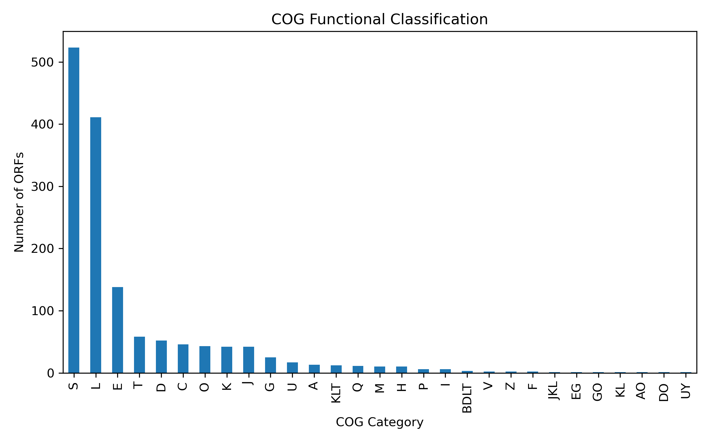
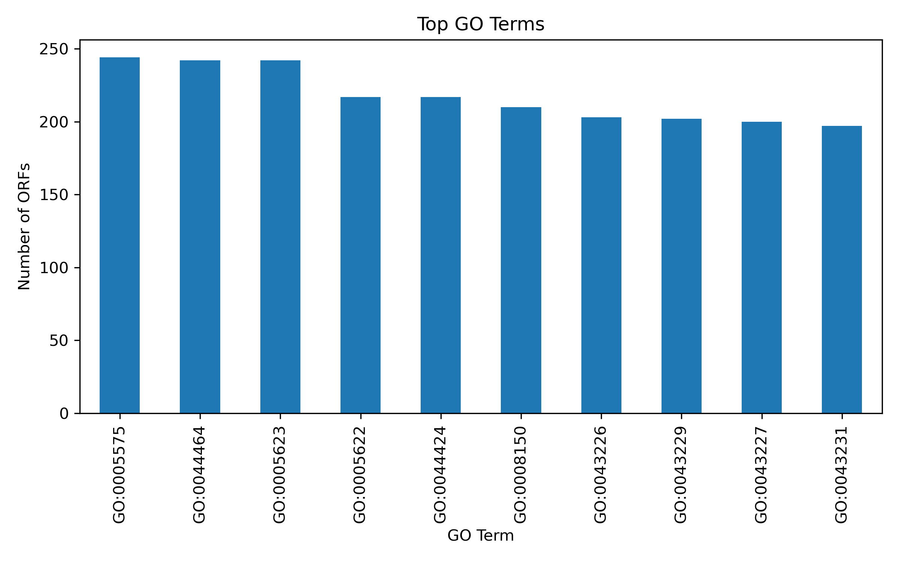
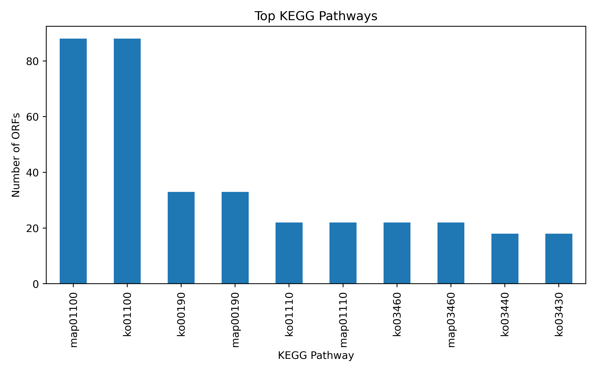
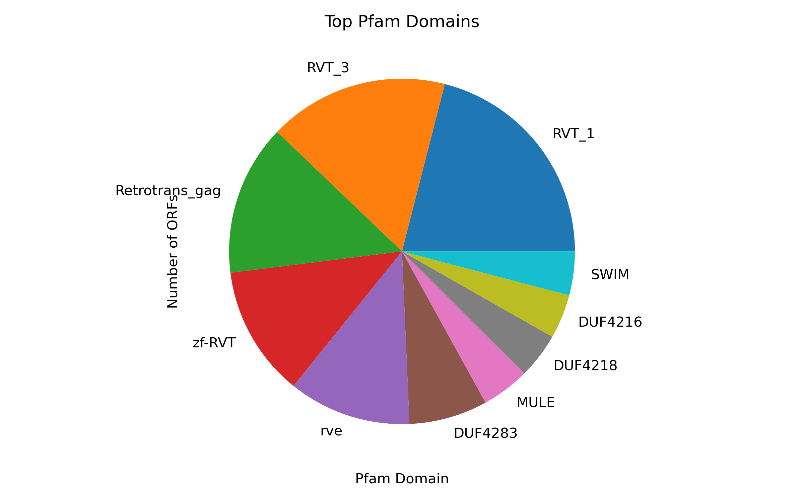

# Quantitative Assessment and Biological Interpretation of Functional Annotation
## Quantitative Assessment of ORF Annotation

Prior to biological interpretation, a quantitative summary was generated to assess the overall success of ORF prediction and functional annotation using eggNOG-mapper. This provides context for downstream functional and pathway-level analyses.

### Summary of ORF Prediction and Annotation

| Parameter                       | Count    | Description                                   |
| ------------------------------- | -------- | --------------------------------------------- |
| Total predicted ORFs            | **2496** | Total ORFs predicted from assembled sequences |
| Successfully annotated ORFs     | **1513** | ORFs with at least one functional assignment  |
| Unannotated ORFs                | **983** | ORFs with no significant match in eggNOG      |
| Percentage annotated            | **60.62 %** | Annotation coverage of predicted ORFs         |

A substantial proportion of predicted ORFs were successfully annotated, indicating good assembly quality and database representation. The presence of unannotated ORFs suggests potential novel genes or hypothetical-proteins, which is common plant-associated datasets.

## Biological Interpretation of Functional Annotation

Functional annotation of predicted ORFs was performed using eggNOG-mapper. The annotated genes were analyzed through COG functional classification, Gene Ontology (GO) annotation, KEGG pathway mapping and Pfam domain identification. Visualization using bar and pie charts enabled quantitative assessment and biological interpretation of the functional landscape.

### 1. COG Functional Classification

The COG classification shows a non-uniform distribution of annotated ORFs across functional categories. The most abundant categories include S, L, and E, followed by T, D, C, O, K, and J, while several categories show low representation.

  

### Biological Interpretation by COG Category

**S — Function Unknown**

 - This is the largest category represents proteins with conserved sequences but unknown biological roles.

 - Common in plant genomes, non-model organisms and draft assemblies.

 - Indicates the presence of novel, lineage-specific or poorly characterized genes.

 - **Biological significance:** This category highlights the potential for discovering new biological functions and regulatory mechanisms.

**L — Replication, Recombination and Repair**

 - Strongly represented includes genes involved in DNA repair, recombination and genome maintenance.

 - **Biological significance:** High abundance suggests genome plasticity, frequent recombination and possible activity of mobile genetic elements, consistent with transposon-rich genomes.

**E — Amino Acid Transport and Metabolism**

 - One of the most abundant metabolic categories.

 - **Biological significance:** Indicates active amino acid biosynthesis and transport, essential for protein production, stress adaptation and metabolic flexibility.

**T — Signal Transduction Mechanisms**

 - Moderately represented.

 - **Biological significance:** Reflects the presence of signaling pathways for environmental sensing, hormonal signaling, and regulatory control.

**D — Cell Cycle Control and Cell Division**

 - Indicates regulated cell division and growth.

 - **Biological significance:** Supports tissue development and cellular differentiation.

**C — Energy Production and Conversion**

 - Associated with respiration and energy metabolism.

 - **Biological significance:** Confirms active cellular energy production, supporting biosynthetic processes.

**O, K, J — Protein Turnover, Transcription, Translation**

 - Represent core cellular processes.

 - **Biological significance:** These categories confirm the presence of essential machinery for gene expression, protein synthesis and protein quality control.

### 2. Gene Ontology (GO) Annotation

The top GO terms are dominated by cellular component-related terms each represented by a large number of ORFs.

  

### Biological Interpretation of Individual GO Terms

**GO:0005575 — Cellular Component**

 - Indicates comprehensive annotation of structural and functional cellular proteins.

**GO:0044464 — Cell Part**

 - Refers to proteins associated with any part of the cell.

 - Suggests involvement in general cellular organization and maintenance.

**GO:0005623 — Cell**

 - Broad term covering proteins functioning within the cell.

 - Confirms that most annotated ORFs encode intracellular proteins.

**GO:0005622 — Intracellular**

 - Proteins localized inside the cell.

 - Indicates dominance of intracellular metabolic, regulatory and structural proteins.

**GO:0044424 — Intracellular Part**

 - Subset of intracellular components.

 - Reinforces the prevalence of proteins involved in core intracellular processes.

**GO:0008150 — Biological Process**

 - Reflects diverse biological roles spanning metabolism, regulation and cellular maintenance.

**GO:0043226 / GO:0043229 / GO:0043227 / GO:0043231**

 - Indicates proteins associated with organelles, supporting metabolic compartmentalization typical of eukaryotic cells.

**Overall GO interpretation:**

 - GO analysis confirms that annotated ORFs are predominantly involved in core cellular structure, intracellular localization and fundamental biological processes validating annotation completeness.

### 3. KEGG Pathway Analysis

The most enriched KEGG pathways include general metabolism, energy metabolism, secondary metabolite biosynthesis and amino acid metabolism.

  

### Biological Interpretation of Individual KEGG Pathways

**map01100 / ko01100 — Metabolic Pathways**

 - Most abundant pathway - Indicates broad metabolic capability involving carbohydrates, lipids, amino acids and energy metabolism.

**map00190 / ko00190 — Oxidative Phosphorylation**

 - Key energy-generating pathway - Confirms active mitochondrial respiration and ATP production.

**map00110 / ko00110 — Biosynthesis of Secondary Metabolites**

 - Includes pathways for specialized compounds - Suggests potential for production of secondary metabolites involved in defense, signaling and medicinal properties.

**map00340 / ko00340 — Histidine Metabolism**

 - Amino acid metabolism pathway - Indicates nitrogen metabolism and amino acid biosynthesis capacity.

**Overall KEGG interpretation:**

KEGG pathway enrichment demonstrates a metabolically active organism with strong energy production and secondary metabolite biosynthesis potential.

### 4. Pfam Domain Distribution

The Pfam pie chart reveals dominance of domains related to transposable elements and retrotransposons.

  

### Biological Interpretation of Major Pfam Domains

**RVT_1 and RVT_3 (Reverse Transcriptase domains)**

 - Strong evidence for high retrotransposon content, typical of plant genomes.

**zf-RVT (Zinc finger reverse transcriptase)**

 - Associated with retroelement regulation suggests regulatory roles in transposon activity.

**rve (Integrase core domain)**

 - Required for insertion of retroelements - Indicates historical or ongoing retrotransposon mobilization.

**Retrotrans_gag**

 - Structural component of retrotransposons, supports abundance of LTR retrotransposons.

**MULE**

 - DNA transposon-associated domain indicates presence of Mutator-like elements contributing to genome rearrangement.

**DUF4216, DUF4218, DUF4283**

 - Domains of unknown function suggest novel or poorly characterized proteins, consistent with high COG category S.

**SWIM**

 - Zinc-binding domain often involved in DNA interaction - May participate in transcriptional regulation or genome stability.

## Integrated Interpretation

 - COG and Pfam analyses consistently indicate genome plasticity driven by transposable elements.

 - GO terms confirm core cellular and intracellular functional dominance.

 - KEGG pathways highlight robust metabolic and biosynthetic capacity.

 - High unknown-function content suggests future scope for functional discovery.

## Data Validation and Annotation Confidence

To ensure robustness and reproducibility of the biological interpretations, functional annotations were validated using standardized, community-curated databases. 

 - COG functional categories were validated using official COG definitions curated by NCBI. Each single-letter COG code corresponds to a fixed biological meaning (e.g., S: function unknown; L: replication, recombination, and repair), ensuring consistency in functional interpretation.

 - Gene Ontology (GO) annotations were validated by cross-referencing GO identifiers with authoritative GO browsers such as QuickGO (Official browser for Gene Ontology terms). Each GO term corresponds to a unique, globally defined biological concept within the Biological Process, Molecular Function or Cellular Component ontologies.

 - KEGG pathway assignments were validated using curated KEGG pathway definitions. Dominant pathways such as metabolic pathways (ko01100) reflect core biochemical functions expected in genomic datasets.

 - Pfam domain annotations were validated using Hidden Markov Model (HMM)-based domain definitions from the Pfam database. Enriched domains such as reverse transcriptase (RVT) and integrase domains were verified to represent mobile genetic elements, supporting interpretations related to genome plasticity.

Cross-database consistency among COG, GO, KEGG, and Pfam annotations further strengthens confidence in the inferred biological functions.

## Conclusion

The integrated functional annotation reveals a genome characterized by:

 - Strong metabolic activity

 - Extensive transposable element content

 - Core cellular and regulatory functions

 - Significant novel genetic potential

This comprehensive quantitative and biological interpretation validates the functional annotation pipeline and provides insights into genome organization and biological complexity.