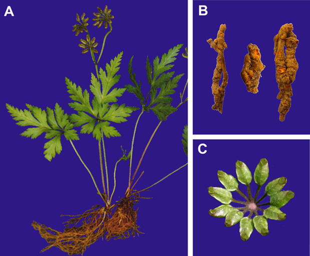
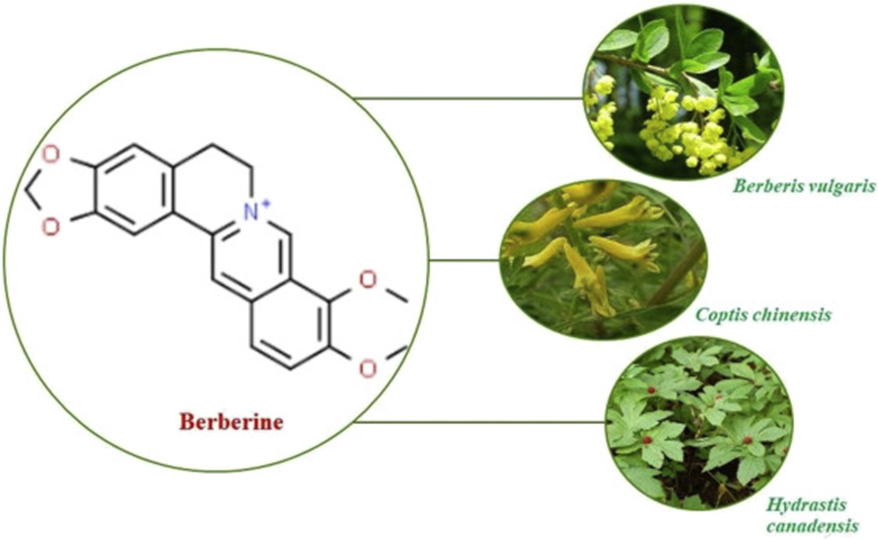

# **Coptis chinensis(Chinese goldthread)**
- Coptis chinensis, also known as **Chinese goldthread or Huanglian**, is a perennial herbaceous plant native to China and belongs to the **Ranunculaceae family**. 

- It grows mainly in mountainous regions at altitudes of 500 to 2200 meters. The plant has yellow branched rhizomes and slightly leathery leaves with three lobes. 

- It typically flowers from February to March, with fruit harvested from April to June.

- The rhizome of Coptis chinensis is **highly valued in traditional Chinese medicine** and is one of the 50 fundamental herbs. 

- It has been used for over 2000 years to treat various ailments, including bacillary dysentery, diabetes, sore throat, and eczema. 

- Besides medicinal uses, **Berberine** extracted from the plant has been traditionally used as a dye for wool and other Fibers due to its strong colouring properties.

  

# **Main Active Compounds in Coptis chinensis**
- Alkaloids are a group of **naturally occurring organic compounds containing basic nitrogen atoms.** They often have significant biological effects and are commonly found in medicinal plants. 

- The main active compounds in Coptis chinensis are isoquinoline alkaloids, primarily concentrated in the plant's rhizome and are responsible for its broad pharmacological profile.
## **Key Alkaloids and their effects**
- **Berberine:** The most abundant and well-studied alkaloid, berberine exhibits strong antibacterial, anti-inflammatory, antioxidant, antitumor, antidiabetic, and cardiovascular protective effects. It has been shown to lower blood glucose and lipid levels, regulate inflammation, protect against neuronal damage, and modulate the gut microbiome.

- **Coptisine:** This alkaloid has significant antibacterial and anti-inflammatory effects and contributes to regulation of signaling pathways involved in inflammation and cellular stress.

- **Palmatine:** It shows antibacterial, anti-inflammatory, and neuroprotective properties, as well as roles in modulating cell apoptosis and immune response.

- **Jatrorrhizine:** It has been reported to demonstrate antioxidant, anti-inflammatory, and antimicrobial activity, and may help regulate lipid metabolism.

- **Epiberberine and Magnoflorine:** These minor alkaloids also contribute anti-inflammatory, antioxidant, and immunomodulatory benefits.

- **Columbamine and Worenine:** Lesser-known alkaloids contributing to the overall bioactivity.
### **Biological Effects**
- These alkaloids work synergistically to provide therapeutic benefits like anti-inflammatory, antioxidative, immune-modulating, and neuroprotective effects. 

- For example, berberine and coptisine inhibit inflammatory signaling pathways such as NF-κB and MAPK, while magnoflorine regulates immune cell differentiation.

| Alkaloid      | Molecular Formula | Relative Content (%) | Notes                                           |
|---------------|------------------|---------------------|-------------------------------------------------|
| Berberine     | C20H18NO4        | ~6.21               | Most abundant and bioactive; antibacterial, anti-inflammatory |
| Palmatine     | C21H21NO4        | ~1.62               | Similar effects as berberine; antimicrobial and anti-inflammatory |
| Epiberberine  | C20H18NO4        | ~1.53               | Close structural isomer to berberine             |
| Jatrorrhizine | C20H19NO4        | ~0.62               | Contributes to antimicrobial and anti-inflammatory activity |
| Coptisine     | C19H13NO4        | ~0.49               | Also contributes to anti-inflammatory effects     |
| Magnoflorine  | C20H24NO4        | Trace amounts       | Immune modulation and antioxidant effects         |
| Columbamine   | C20H20NO4        | Trace               | Part of alkaloid profile                         |
| Worenine      | C20H15NO4        | Trace               | Lesser-known alkaloid                            |

# **Structure of Alkaloids**
- These alkaloids share a tetracyclic ring system derived from isoquinoline, with variations in substituents (e.g., methoxy, hydroxyl groups) affecting their bioactivity. The structures feature a core of four fused rings, including a benzodioxole moiety in some compounds, which influences their pharmacological properties. 

- Berberine’s structure is often used as a representative for this group, showcasing its planar, aromatic, and charged form that enables interaction with biological targets.

  

# **Varieties and related species**
Within the genus Coptis, several species are closely related to Coptis chinensis and are used for medicinal purposes in China and nearby regions:

- **Coptis chinensis:** The most widely distributed and commonly used species, known as Huanglian in Chinese medicine and grown extensively in southwest China.

- **Coptis deltoidea:** Endemic to regions around Mount Emei in Sichuan province, genetically close to C. omeiensis.

- **Coptis omeiensis:** Also native to Sichuan, forming a sister group with C. deltoidea due to similar environmental adaptations.

- **Coptis teeta**: Found primarily in Yunnan province, with unique environmental requirements compared to other species.
Other species in the genus include C. trifolia (North America) and C. japonica (Japan), but these have different alkaloid profiles and medicinal properties compared to C. chinensis.
# **Key reasons to select Coptis chinensis**

**Medicinal Importance:** Coptis chinensis is a well-known medicinal plant used for centuries in traditional Chinese medicine due to its potent bioactive alkaloids like berberine, making it valuable for therapeutic research.​

**Rich in Bioactive Compounds:** The plant synthesizes multiple pharmacologically active compounds with antibacterial, anti-inflammatory, anti-diabetic, and anticancer properties, providing a meaningful focus for genomic and biosynthetic pathway studies.​

**Conservation Concerns:** Overharvesting in the wild has led to conservation challenges; genomic studies can aid in sustainable utilization, cultivation strategies, and preservation of genetic diversity.​

**Economic Value:** As a high-value medicinal plant, genetic improvement through genomics and bioinformatics can enhance yield, quality, and stress resistance, impacting cultivation and commercialization.​

**Model for Alkaloid Biosynthesis:** Coptis chinensis serves as a model to study complex alkaloid biosynthesis pathways with applications in metabolic engineering and pharmaceutical production.​

**Ecological Adaptations:** Its adaptation to specific mountainous environments provides insights into genetic mechanisms of environmental tolerance relevant to plant biology and breeding.​

# **Justification for use of Bioinformatics in Plant Genomics Study**
**Managing Large-scale Genomic Data:** Plant genomics projects generate enormous datasets from sequencing and other omics technologies that can only be efficiently processed and analyzed with bioinformatics tools.

**Accelerating Crop Improvement:** Bioinformatics enables marker-assisted and genomic selection approaches, helping speed up breeding for improved yield, disease resistance, abiotic stress tolerance, and quality traits.

**Understanding Gene Function:** It facilitates annotation, functional analysis, and regulatory pathway elucidation of genes, essential for deciphering plant biological processes and responses.

**Comparative Genomics:** Allows cross-species genome comparisons to identify conserved and unique features, aiding transfer of knowledge from model plants to crops.

**Improving Disease Resistance:** Bioinformatics helps identify pathogen effectors, plant resistance genes, and mechanisms of host-pathogen interactions for better disease management.

**Facilitating Sustainable Agriculture:** Genomic insights powered by bioinformatics contribute to developing crops that reduce reliance on chemical inputs and withstand environmental stresses.

**Conservation of Genetic Diversity:** Assists in cataloging and preserving genetic resources important for crop adaptation and long-term resilience.

**Integrating Multi-dimensional Data:** Combines genomic, transcriptomic, phenotypic, and environmental data for predictive modeling and precision agriculture applications.

**Dissecting Biosynthetic Pathways:** Supports metabolic pathway characterization and engineering in medicinal and economically important plants.

**Enabling Reproducibility and Scalability:** Provides frameworks and pipelines that ensure reproducible, scalable, and high-throughput analysis suited for evolving genomic technologies

